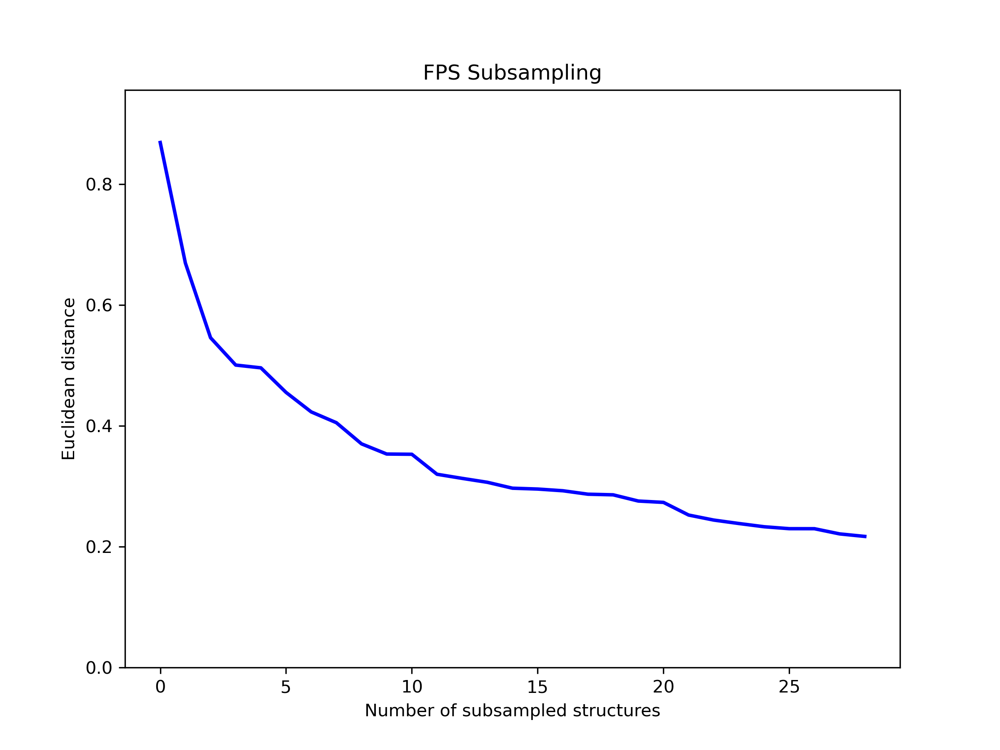
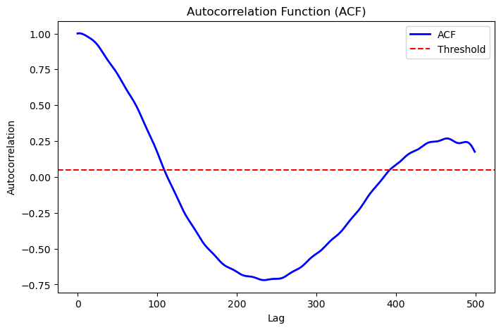
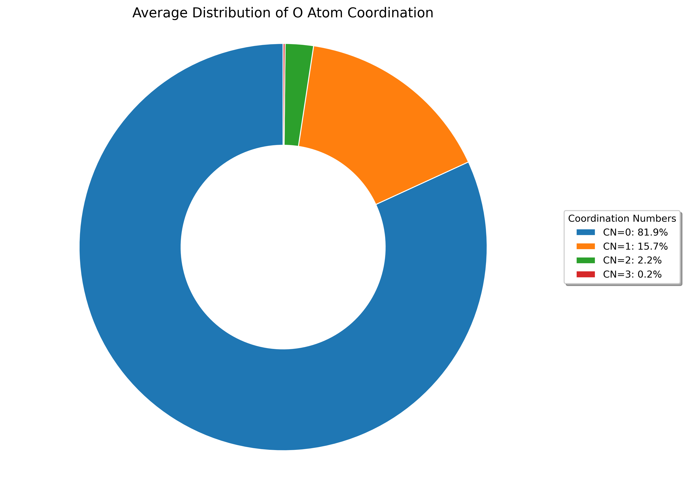
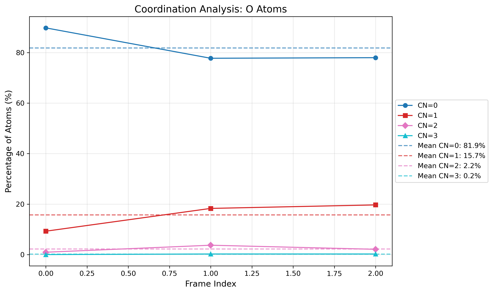
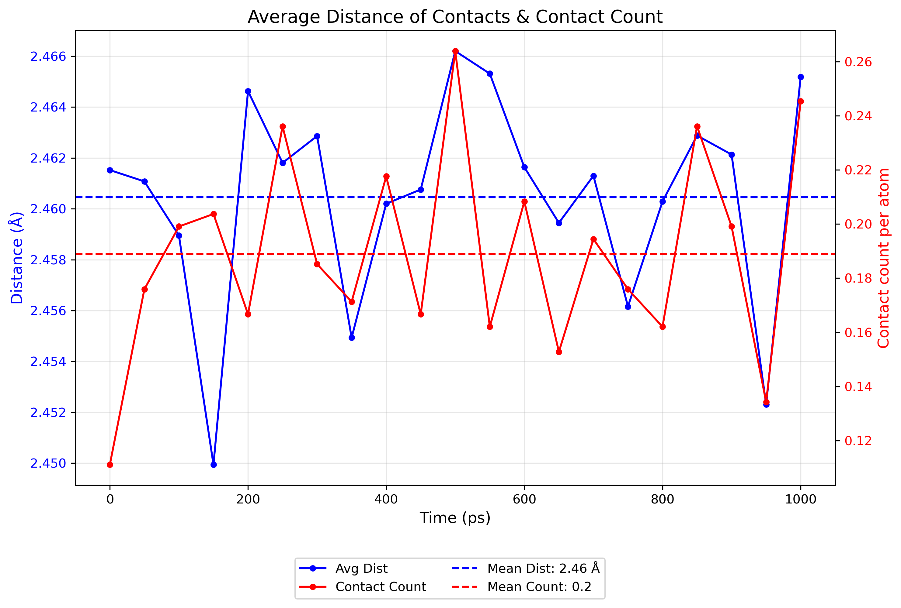
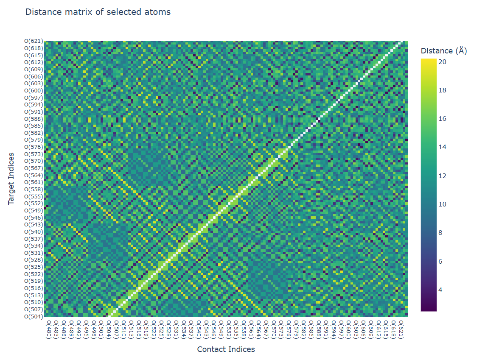
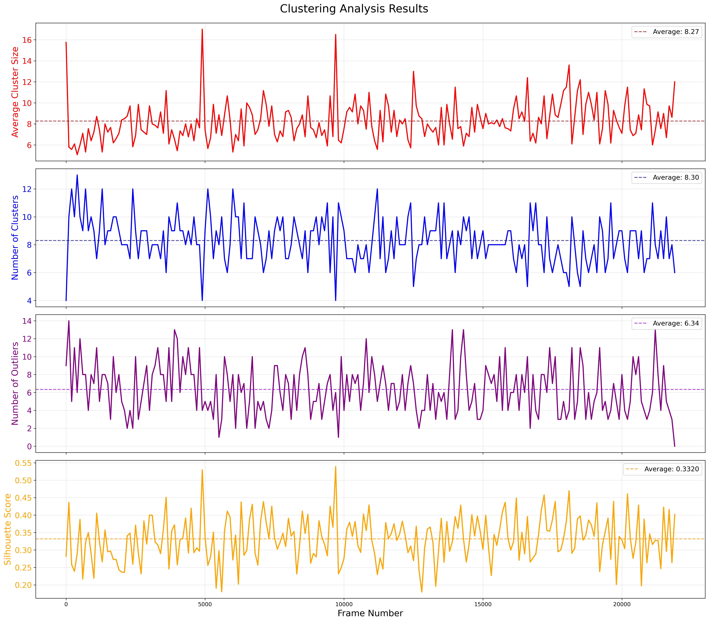

Introductory Tutorials
======================

This section provides an overview of the basic functionalities offered by CRISP. \
Each tutorial introduces a specific feature of the package, guiding you through typical use cases.

First verify the installation by importing CRISP and its dependencies:

.. code:: python

    import CRISP
    print(f"CRISP version: {CRISP.__version__}")

CRISP is organized into two main subpackages:

- ``simulation_utility``: Tools for preparing and processing simulation data
- ``data_analysis``: Methods for analyzing simulation results

The following tutorials are organized according to these subpackages.

Simulation Utility
--------------------

This section covers utilities for manipulating and preparing simulation data.

Atomic Indices
^^^^^^^^^^^^^^^^

CRISP allows for the classification of atoms based on custom-defined indices, 
making it easier to analyze specific subsets within your simulation data.

1. **Classify Atom Indices**

   .. code:: python

       from CRISP.simulation_utility.atomic_indices import run_atom_indices

       # Path to your ASE trajectory file
       file_path = "./wrapped_traj.traj"

       # Output folder to save the indices
       output_folder = './indices_new/'

       # Define the custom cutoffs dictionary 
       custom_cutoffs = {
           ("O", "H"): 1.2,
           ("Si", "O"): 1.8,
           ("Al", "Si"): 3.2,
           ("O", "O"): 3.0
       }

       # Run the atom_indices function and save the results with a specific frame index
       run_atom_indices(file_path, output_folder, frame_index=10, custom_cutoffs=custom_cutoffs)

   **Output:**

   .. code-block:: text

       Analyzing frame with index 10 (out of 21 frames)
       Length of O indices: 432
       Length of H indices: 120
       Length of Si indices: 168
       Length of Al indices: 24
       Outputs saved.
       Saved cutoff indices for O-H to ./indices_new/cutoff/O-H_cutoff.csv
       Saved cutoff indices for Si-O to ./indices_new/cutoff/Si-O_cutoff.csv
       Saved cutoff indices for Al-Si to ./indices_new/cutoff/Al-Si_cutoff.csv
       Saved cutoff indices for O-O to ./indices_new/cutoff/O-O_cutoff.csv

Atomic Trajectory Visualization
^^^^^^^^^^^^^^^^^^^^^^^^^^^^^^^^

Visualize atomic trajectories in 3D to understand motion and structural changes.

.. code:: python

    from CRISP.simulation_utility.atomic_traj_linemap import plot_atomic_trajectory

    # Path to trajectory file
    traj_file = "./wrapped_traj.traj"
    
    # Output directory for the visualization
    output_dir = "./atomic_traj_linemap/o593_atom_trajectory.html"
    
    # Select specific atom for trajectory analysis
    selected_atoms = [593]
    
    # Generate interactive 3D visualization of trajectories
    fig = plot_atomic_trajectory(
        traj_path=traj_file, 
        indices_path=selected_atoms,
        output_dir=output_dir,
        frame_skip=1,
        plot_title="Oxygen Atom Movement Analysis",
        atom_size_scale=1.2,
        show_plot=True
    )

**Output:**

.. code-block:: text

    Loading trajectory from ./wrapped_traj.traj (using every 1th frame)...
    Loaded 21 frames from trajectory
    Using 1 directly provided atom indices for trajectory plotting
    Simulation box dimensions: [24.34499931 24.34499931 24.34499931] Å
    Analyzing atom types in first frame (total atoms: 744, max index: 743)...
    Found 4 atom types: Si, Al, O, H
    Plot has been saved to ./atomic_traj_linemap/o593_atom_trajectory.html/trajectory_plot.html

**Visualisation Output:**

.. raw:: html
   :file: ../images/introductory_tutorials/atomic_traj_linemap/o593_atom_trajectory.html/trajectory_plot.html

This interactive 3D visualization allows you to:

- Rotate, zoom, and pan to explore atomic trajectories
- Track the movement of selected atoms over time
- Visualize the trajectory path with customizable atom sizes
- Understand atomic motion patterns within the simulation box

Subsampling
^^^^^^^^^^^^^^^^

Extract representative structures from a trajectory using Farthest Point Sampling.

.. code:: python

    from CRISP.simulation_utility.subsampling import subsample
    
    # Extract representative structures from trajectory
    all_frames = subsample(
        traj_path="./wrapped_traj.traj",
        n_samples=10,
        index_type="all",
        file_format="traj",
        frame_skip=1,
        plot_subsample=True,
        output_dir="./Subsmapling"
    )
    
    print(f"Selected {len(all_frames)} representative structures")

**Output:**

.. code-block:: text

   Saved convergence plot to ./Subsmapling/subsampled_convergence.png
   Saved 10 subsampled structures to ./Subsmapling/subsample_wrapped_traj.traj

**Visualisation Output:**

The convergence plot shows the distance between each sampled structure and its nearest neighbor, 
illustrating how the algorithm selects maximally diverse structures from the trajectory.

Error Analysis
^^^^^^^^^^^^^^

Perform statistical error analysis on time-correlated simulation data using different methods.

Example 1: Position Data Analysis
***********************************

.. code:: python

    from CRISP.simulation_utility.error_analysis import autocorrelation_analysis
    import numpy as np
    
    # Load position data
    data_positions = np.load("./error/positions.npy")
    
    # Analyze using autocorrelation method
    res_positions = autocorrelation_analysis(
        data_positions,
        plot_acf=True,
        max_lag=500
    )
    
    print(res_positions)

**Output:**

.. code-block:: text

    {'mean': array([11.84336219,  6.56230374,  6.34512439]), 
     'acf_err': array([0.11042688, 0.0483816 , 0.06882431]), 
     'std': array([0.21002227, 0.09201757, 0.13089782]), 
     'tau_int': 69.11286151958006, 
     'optimal_lag': 109}

**Visualization Output:**

Example 2: Energy Data Analysis
*********************************

.. code:: python

    from CRISP.simulation_utility.error_analysis import autocorrelation_analysis, block_analysis
    import numpy as np
    
    # Load energy data from log file
    data_energy = np.loadtxt("./error/md_20k.log", skiprows=1, usecols=2)
    
    # Analyze using autocorrelation method
    acf_error = autocorrelation_analysis(data_energy, plot_acf=True)
    
    # Analyze using blocking method
    block_error = block_analysis(data_energy, convergence_tol=0.001, plot_blocks=False)
    
    print(acf_error)
    print(block_error)

**Output:**

.. code-block:: text

    {'mean': -3065.5796212000005, 
     'acf_err': 0.0054549762052233325, 
     'std': 0.6834300195116669, 
     'tau_int': 0.318542675191111, 
     'optimal_lag': 9}
    {'mean': -3065.5796212000005, 
     'block_err': 0.02208793396091249, 
     'std': 0.6834300195116669, 
     'converged_blocks': 32}

**Visualization Output:**

.. image:: ../images/introductory_tutorials/ACF_ener_analysis.png
   :width: 600
   :alt: Autocorrelation function for energy data

Interatomic Distance Calculation
^^^^^^^^^^^^^^^^^^^^^^^^^^^^^^^^^^

Calculate and save distance matrices between atoms for further analysis.

.. code:: python

    from CRISP.simulation_utility.interatomic_distances import distance_calculation, save_distance_matrices

    # Path to trajectory file
    traj_path = "./wrapped_traj.traj"
    frame_skip = 10
    index_type = ["O"]  # Focus on oxygen atoms

    # Calculate full and subset distance matrices
    full_dms, sub_dms = distance_calculation(traj_path, frame_skip, index_type)

    # Save the calculated distance matrices
    save_distance_matrices(full_dms, sub_dms, index_type, output_dir="distance_calculations_zeo")

**Output:**

.. code-block:: text

    Distance matrices saved in 'distance_calculations_zeo/distance_matrices.pkl'

This utility calculates distance matrices between atoms, accounting for periodic boundary conditions, and saves the results for later use in clustering or other analyses.

Data Analysis
---------------

This section covers methods for analyzing simulation results and extracting physical insights.

Contact and Coordination Analysis
^^^^^^^^^^^^^^^^^^^^^^^^^^^^^^^^^^

CRISP provides tools to analyze both coordination environments and dynamic contacts between atoms.

1. Coordination Analysis
**************************

.. code:: python

    from CRISP.data_analysis.contact_coordination import coordination
    
    # Path to trajectory file
    filename = "./wrapped_traj.traj"
    
    # Define target and bonded atoms for coordination analysis
    target_atoms = "O"
    bonded_atoms = ["O"]
    
    # Define custom cutoffs for coordination
    custom_cutoffs = {('Al', 'O'): 3.5, ('O', 'O'): 2.5}
    
    # Perform coordination analysis
    cn = coordination(filename, 
                     target_atoms, bonded_atoms, custom_cutoffs, 
                     skip_frames=10, plot_cn=True, output_dir="./CN_data")

**Output:**

.. code-block:: text

    Interactive coordination distribution chart saved to ./CN_data/CN_distribution.html

**Visualization Output:**

The visualizations show both:
- The distribution of coordination numbers across all analyzed frames, revealing dominant coordination environments
- The time evolution of coordination numbers throughout the trajectory, showing structural changes over time

The visualization shows the distribution of coordination numbers for the selected atom types,
allowing you to identify dominant coordination environments and their frequencies throughout
the simulation trajectory.

2. Contact Analysis
********************

.. code:: python

    from CRISP.data_analysis.contact_coordination import contacts
    
    # Path to trajectory file
    filename = "./wrapped_traj.traj"
    
    # Define target and bonded atoms for contact analysis
    target_atoms = "O"
    bonded_atoms = ["O"]
    
    # Define custom cutoffs for contacts
    custom_cutoffs = {('Al', 'O'): 3.5, ('O', 'O'): 2.5}
    
    # Perform contact analysis
    sub_dm, cal_contacts = contacts(
        filename, target_atoms, bonded_atoms, custom_cutoffs,
        skip_frames=1,
        plot_distance_matrix=True,
        plot_contacts=True,
        time_step=50.0*1000,  # fs
        output_dir="./Contacts_data")

**Output:**

.. code-block:: text

    Interactive contact heatmap saved to ./Contacts_data/O_heatmap_contacts.html
    Interactive contact analysis chart saved to ./Contacts_data/average_contact_analysis.html
    Static contact analysis chart saved to ./Contacts_data/average_contact_analysis.png
    Interactive distance heatmap saved to ./Contacts_data/O_heatmap_distance.html

**Visualization Output:**

.. image:: ../images/introductory_tutorials/Contacts_data/contact_time_heatmap.png
   :width: 600
   :alt: Contact time heatmap

The contact analysis provides multiple visualizations:
 - A summary of average contact statistics and their distribution
 - A distance heatmap showing the spatial relationships between atoms
 - A time heatmap showing the persistence of contacts throughout the trajectory

These visualizations enable the identification of persistent contacts and transient
interactions throughout the simulation trajectory.

Hydrogen-Bonding Analysis
^^^^^^^^^^^^^^^^^^^^^^^^^^

Analyze hydrogen bond networks and dynamics in your simulation.

.. code:: python

    from CRISP.data_analysis.h_bond import hydrogen_bonds
    
    # Perform hydrogen bond analysis
    h_bonds_both_plots = hydrogen_bonds(
        traj_path="./wrapped_traj.traj",
        frame_skip=1,
        acceptor_atoms=["O"],
        angle_cutoff=120,
        mic=True,
        output_dir="./H_Bond_Data",
        time_step=50*1000,
        plot_count=True,
        plot_heatmap=True,
        plot_graph_frame=True,        # Generate frame-specific plot
        plot_graph_average=True,      # Generate average plot
        graph_frame_index=10          # Use frame 10 instead of default 0
    )

**Output:**

.. code-block:: text

    Hydrogen bond count plot saved to './H_Bond_Data/h_bond_count.png'
    H-bond structure 2D histogram saved to './H_Bond_Data/h_bond_structure.png'
    Generated and saved 196 unique donor/acceptor atom indices to ./H_Bond_Data/donor_acceptor_indices.npy
    Generating hydrogen bond network visualizations for frame 10...
    Interactive correlation matrix saved as './H_Bond_Data/hbond_correlation_matrix_frame_10.html'
    Figure saved as './H_Bond_Data/hbond_network_frame_10.html'
    Generating average hydrogen bond network visualization...
    Interactive correlation matrix saved as './H_Bond_Data/hbond_correlation_matrix_average.html'
    Figure saved as './H_Bond_Data/hbond_network_average.html'

**Visualization Output:**

.. image:: ../images/introductory_tutorials/H_Bond_Data/h_bond_count.png
   :width: 600
   :alt: Hydrogen bond count over time

.. image:: ../images/introductory_tutorials/H_Bond_Data/h_bond_structure.png
   :width: 600
   :alt: Hydrogen bond structure heatmap

.. raw:: html
   :file: ../images/introductory_tutorials/H_Bond_Data/hbond_network_frame_10.html

.. raw:: html
   :file: ../images/introductory_tutorials/H_Bond_Data/hbond_correlation_matrix_frame_10.html

The hydrogen bond analysis provides multiple complementary visualizations:

- **Time series** of hydrogen bond counts throughout the trajectory
- **Heatmap** showing hydrogen bond structure and persistence over time
- **Interactive network graph** showing hydrogen bonding patterns for a specific frame (frame 10)
- **Correlation matrix** visualizing the strength and frequency of hydrogen bonds between specific atoms

These visualizations work together to provide a comprehensive understanding of hydrogen bonding networks, 
enabling both qualitative pattern recognition through the network graph and quantitative analysis 
through the correlation matrix. The analysis identified 196 unique donor/acceptor atom pairs and 
provides both frame-specific and time-averaged hydrogen bonding information.

Radial Distribution Function (RDF)
^^^^^^^^^^^^^^^^^^^^^^^^^^^^^^^^^^

Perform Radial Distribution Function analysis to investigate spatial relationships between atoms.

.. code:: python

    from CRISP.data_analysis.prdf import analyze_rdf
    
    # Path to trajectory file
    traj_file = "./wrapped_traj.traj"
    
    # RDF parameters
    rmax = 10.0         # Maximum radius
    nbins = 50          # Number of bins for histogram
    frame_skip = 1      # Analyze every frame
    output_dir = "custom_ase"
    output_filename = None  # Auto-generate filename
    use_prdf = False    # Calculate total RDF (not partial)
    atomic_indices = None
    
    # Perform RDF analysis
    data_rdf = analyze_rdf(
        use_prdf=use_prdf,
        rmax=rmax,
        traj_path=traj_file,
        nbins=nbins,
        frame_skip=frame_skip,
        output_filename=output_filename,
        atomic_indices=atomic_indices,
        output_dir=output_dir,
        plot_prdf=True  # Generate plots
    )

**Output:**

.. code-block:: text

    Data saved in 'custom_ase/rdf_total.pkl'
    Static plot saved in 'custom_ase/rdf_total_plot.png'
    Interactive animation saved to 'custom_ase/rdf_total_animation.html'
    GIF animation saved to 'custom_ase/rdf_total_animation.gif'
    Animation saved in 'custom_ase/rdf_total_animation.gif'

**Visualization Output:**

.. image:: ../images/introductory_tutorials/RDF/rdf_total_plot.png
   :width: 600
   :alt: Radial Distribution Function plot

.. raw:: html
   :file: ../images/introductory_tutorials/RDF/rdf_total_animation.html

The RDF analysis provides both static and interactive visualizations:

- A static plot showing the time-averaged radial distribution function
- An interactive animation displaying the evolution of the RDF across multiple frames

These visualizations help identify characteristic distances between atoms and structural 
features such as coordination shells and their changes throughout the simulation.

Mean-Square Displacement (MSD)
^^^^^^^^^^^^^^^^^^^^^^^^^^^^^^^

Calculate and visualize Mean-Square Displacement to analyze diffusion in two steps.

Step 1: Calculate MSD values from trajectory
*********************************************

.. code:: python

    from CRISP.data_analysis.msd import calculate_save_msd
    
    # Path to trajectory and indices files
    traj_file = "./SiAl15/nvt.traj"
    indices_file = "./SiAl15/indices_needed/ex_fram_ox.npy"
    timestep = 50 * 10  # fs
    
    # Calculate MSD values and save to CSV
    msd_values, msd_times = calculate_save_msd(
        traj_path=traj_file,
        timestep_fs=timestep,
        indices_path=indices_file,
        output_file="msd_results.csv",
        frame_skip=10
    )

**Output:**

.. code-block:: text

    Loaded 2200 frames after applying frame_skip=10
    Loaded 72 atom indices
    Using timestep: 500 fs
    Calculating MSD using parallel processing...
    MSD data has been saved to traj_csv_detailed/msd_results.csv

Step 2: Analyze MSD data and calculate diffusion coefficient
**************************************************************

.. code:: python

    from CRISP.data_analysis.msd import analyze_from_csv
    import pandas as pd
    
    # Load the MSD data CSV file
    df = pd.read_csv("./traj_csv_detailed/msd_results.csv")
    print(f"Total data points in file: {len(df)}")
    
    # Calculate diffusion coefficient from MSD data
    D, error = analyze_from_csv(
        csv_file="./traj_csv_detailed/msd_results.csv",
        fit_start=0,
        fit_end=len(df),  
        with_intercept=True,
        plot_msd=True,
        plot_diffusion=True,
        n_blocks=5
    )

**Output:**

.. code-block:: text

    Total data points in file: 2200
    Loaded MSD data from ./traj_csv_detailed/msd_results.csv
    Diffusion Coefficient: 4.77e-07 cm²/s
    Error in the Fit: 3.80e-09 cm²/s
    Diffusion coefficient evolution plot saved to: ./traj_csv_detailed/msd_results_3D_diffusion_evolution.png
    MSD Analysis Results (Standard Fit):
    Diffusion Coefficient: D = 4.7665e-07 ± 3.8004e-09 cm²/s (0.8%)

**Visualization Output:**

.. image:: ../images/introductory_tutorials/msd_analysis.png
   :width: 600
   :alt: Mean Square Displacement plot

.. image:: ../images/introductory_tutorials/traj_csv_detailed/msd_results_3D_diffusion_evolution.png
   :width: 600
   :alt: Diffusion coefficient evolution plot

The MSD analysis provides comprehensive quantitative information about particle diffusion:

- **Diffusion coefficient (D)**: 4.77e-07 cm²/s with statistical error (3.80e-09 cm²/s)
- **Relative error**: 0.8%, indicating high precision in the measurement
- **Visual representation**: MSD vs. time with linear fit showing the diffusive behavior
- **Evolution plot**: 3D visualization showing how the diffusion coefficient converges over different time windows

This two-step approach allows for efficient analysis of large trajectories by first extracting 
the MSD data and then performing detailed statistical analysis without reprocessing the trajectory. 
The block analysis (n_blocks=5) provides additional confidence in the diffusion coefficient measurement 
by examining its convergence behavior.

Clustering Analysis
^^^^^^^^^^^^^^^^^^^^^^^^^

Identify atomic clusters using advanced clustering algorithms. CRISP offers both single-frame and trajectory-based clustering analysis.

1. Single-Frame Clustering
***************************

Analyze clusters in a specific frame of your trajectory:

.. code:: python

    from CRISP.data_analysis.clustering import analyze_frame
    import numpy as np
    import os

    # Path to trajectory and indices files
    traj_file = "./SiAl15/nvt.traj"
    indices_file = "./SiAl15/indices_needed/ex_fram_ox.npy"
    
    # Clustering parameters
    threshold = 3.0
    min_samples = 3
    output_dir = "SiAl15_Frame_clustering"

    os.makedirs(output_dir, exist_ok=True)

    # Load atom indices
    atom_indices = np.load(indices_file)

    # Create analyzer instance and perform clustering
    analyzer = analyze_frame(
        traj_path=traj_file,
        atom_indices=atom_indices,
        threshold=threshold,
        min_samples=min_samples,
        metric='precomputed',
        custom_frame_index=-1  # Analyze last frame
    )

    # Perform clustering analysis
    results = analyzer.analyze_structure(output_dir=output_dir)

**Output:**

.. code-block:: text

    Saving results to directory: SiAl15_Frame_clustering
    3D visualization saved to SiAl15_Frame_clustering/nvt_clusters.html

    Number of Clusters: 10
    Number of Outliers: 9
    Silhouette Score: 0.2932
    Average Cluster Size: 6.30
    Cluster Information:
      Cluster 0: 14 points
      Cluster 1: 9 points
      Cluster 2: 4 points
      Cluster 3: 7 points
      Cluster 4: 10 points
      Cluster 5: 5 points
      Cluster 6: 3 points
      Cluster 7: 4 points
      Cluster 8: 4 points
      Cluster 9: 3 points
    Detailed frame data saved to: SiAl15_Frame_clustering/frame_data.txt
    Full analysis data saved to: SiAl15_Frame_clustering/single_frame_analysis.pkl

**Visualization Output:**

.. raw:: html
   :file: ../images/introductory_tutorials/SiAl15_Frame_clustering/nvt_clusters.html

The 3D visualization shows the spatial distribution of clusters in the selected frame, with each cluster 
represented by a different color and unclustered atoms shown separately.

2. Trajectory-Based Clustering
*******************************

Analyze clusters throughout a trajectory to observe their evolution:

.. code:: python

    from CRISP.data_analysis.clustering import analyze_trajectory, save_analysis_results, plot_analysis_results
    import os
    import numpy as np

    # Path to trajectory and indices files
    traj_file = "./SiAl15/nvt.traj"
    indices_file = "./SiAl15/indices_needed/ex_fram_ox.npy"
    
    # Clustering parameters
    threshold = 3.0
    min_samples = 3
    skip_frames = 10  # Analyze every 10th frame
    output_dir = "SiAl15_Traj_clustering"
    output_prefix = "SiAl15_traj_clusters"

    os.makedirs(output_dir, exist_ok=True)

    # Analyze trajectory
    analysis_results = analyze_trajectory(
        traj_path=traj_file,
        indices_path=indices_file,
        threshold=threshold,
        min_samples=min_samples,
        frame_skip=skip_frames,
        output_dir=output_dir,
        save_html_visualizations=True  # Save HTML visualizations of first and last frames
    )

    # Save and plot results
    pickle_file = save_analysis_results(
        analysis_results=analysis_results,
        output_dir=output_dir,
        output_prefix=output_prefix
    )

    plot_analysis_results(pickle_file, output_dir=output_dir)

**Output:**

.. code-block:: text

    Loaded 72 atoms for clustering from ./SiAl15/indices_needed/ex_fram_ox.npy
    Loading trajectory from ./SiAl15/nvt.traj (using every 100th frame)...
    Loaded 220 frames from trajectory
    Analyzing 220 frames...
    3D visualization saved to SiAl15_Traj_clustering/first_frame_clusters.html
    3D visualization saved to SiAl15_Traj_clustering/last_frame_clusters.html
    Trajectory analysis complete: 220 frames processed
    Analysis results saved to directory: SiAl15_Traj_clustering
    Analysis plot saved to: SiAl15_Traj_clustering/SiAl15_traj_clusters_plot.png

**Visualization Output:**

.. raw:: html
   :file: ../images/introductory_tutorials/SiAl15_Traj_clustering/first_frame_clusters.html

.. raw:: html
   :file: ../images/introductory_tutorials/SiAl15_Traj_clustering/last_frame_clusters.html

The trajectory-based clustering analysis provides comprehensive insights into cluster evolution:

- **Temporal Evolution**: Analysis of 220 frames (every 100th frame) showing how clusters change over time
- **72 Atoms Analyzed**: Focused analysis on oxygen atoms from the framework
- **Comparative Visualizations**: Interactive 3D plots of first and last frames showing structural changes
- **Statistical Summary**: Evolution plot tracking cluster statistics throughout the trajectory

This analysis is particularly valuable for understanding:
 - Long-term structural stability and reorganization
 - Phase transitions and nucleation events
 - Self-assembly processes in molecular dynamics simulations
 - Framework flexibility and dynamic behavior in zeolite-like materials

The combination of temporal analysis with 3D visualizations provides both quantitative metrics 
and qualitative insights into the clustering behavior of atoms throughout the simulation.

Volumetric Density
^^^^^^^^^^^^^^^^^^^^^^^^^

Create 3D volumetric density maps to visualize the spatial distribution of atoms throughout a trajectory.

.. code:: python

    from CRISP.data_analysis.volumetric_atomic_density import create_density_map
    import os

    # Path to trajectory and indices files
    traj_file = "./SiAl15/nvt.traj"
    indices_file = "./SiAl15/indices_needed/ex_fram_ox.npy"

    projection_options = [True, False]

    for show_projections in projection_options:
        output_dir = "./SiAl15_Density"
        os.makedirs(output_dir, exist_ok=True)

        proj_text = "with_projections" if show_projections else "no_projections"
        output_file = f"SiAl15_density_{proj_text}.html"

        create_density_map(
            traj_path=traj_file,  
            indices_path=indices_file,  
            frame_skip=100,
            threshold=0.0,
            opacity=0.8,
            absolute_threshold=False,
            save_density=True,
            omit_static_indices=indices_file,  
            show_projections=show_projections,
            projection_opacity=0.8,
            save_projection_images=show_projections,  
            output_dir=output_dir,  
            output_file=output_file
        )

**Output:**

.. code-block:: text

    Loading trajectory from ./SiAl15/nvt.traj (using every 100th frame)...
    Loaded 220 frames, 72 selected indices
    Extracting selected atom positions from trajectory...
    Creating density grid...
    Density data saved to: ./SiAl15_Density/nvt_density_data.npz
    Creating visualization with relative threshold=0.0, opacity=0.8
    Density range: 0.0 to 29.0 counts
    Adding 2D projections of density data...
    XY projection saved to: ./SiAl15_Density/SiAl15_density_with_projections_xy_projection.png
    YZ projection saved to: ./SiAl15_Density/SiAl15_density_with_projections_yz_projection.png
    XZ projection saved to: ./SiAl15_Density/SiAl15_density_with_projections_xz_projection.png
    Skipping atom visualization since projections are enabled
    Visualization saved as HTML file: ./SiAl15_Density/SiAl15_density_with_projections.html
    Loading trajectory from ./SiAl15/nvt.traj (using every 100th frame)...
    Loaded 220 frames, 72 selected indices
    Extracting selected atom positions from trajectory...
    Creating density grid...
    Density data saved to: ./SiAl15_Density/nvt_density_data.npz
    Creating visualization with relative threshold=0.0, opacity=0.8
    Density range: 0.0 to 29.0 counts
    Omitting 72 custom indices from static structure visualization
    Visualization saved as HTML file: ./SiAl15_Density/SiAl15_density_no_projections.html

**Visualization Output:**

.. raw:: html
   :file: ../images/introductory_tutorials/SiAl15_Density/SiAl15_density_no_projections.html

.. image:: ../images/introductory_tutorials/SiAl15_Density/SiAl15_density_with_projections_xy_projection.png
   :width: 250
   :alt: XY projection of density

.. image:: ../images/introductory_tutorials/SiAl15_Density/SiAl15_density_with_projections_yz_projection.png
   :width: 250
   :alt: YZ projection of density

.. image:: ../images/introductory_tutorials/SiAl15_Density/SiAl15_density_with_projections_xz_projection.png
   :width: 250
   :alt: XZ projection of density

The volumetric density analysis provides comprehensive visualization of atomic distribution:

- **3D Density Maps**: Interactive volumetric visualizations showing where oxygen atoms are most frequently located
- **220 Frames Analyzed**: Statistical sampling using every 100th frame for robust density calculations
- **72 Oxygen Atoms**: Focused analysis on extra-framework oxygen atoms
- **Dual Visualization Modes**: 
  - With projections: 2D cross-sectional views (XY, YZ, XZ) for detailed analysis
  - Without projections: Clean 3D view with static framework atoms visible

This analysis is particularly valuable for:
- Identifying preferred locations of mobile species in zeolite frameworks
- Understanding diffusion pathways and bottlenecks
- Visualizing guest molecule distribution patterns
- Analyzing adsorption sites and their accessibility

Example Jupyter Notebooks
---------------------------

For detailed examples and interactive tutorials, refer to the Jupyter notebooks included in the package:

- **Basic Usage Examples**: 
  `https://github.com/Indranil17/CRISP_HOST/blob/main/example/CRISP_Introdcutory_Tutorial.ipynb`

These notebook provide step-by-step examples with visualizations to help you understand how to use CRISP effectively.

