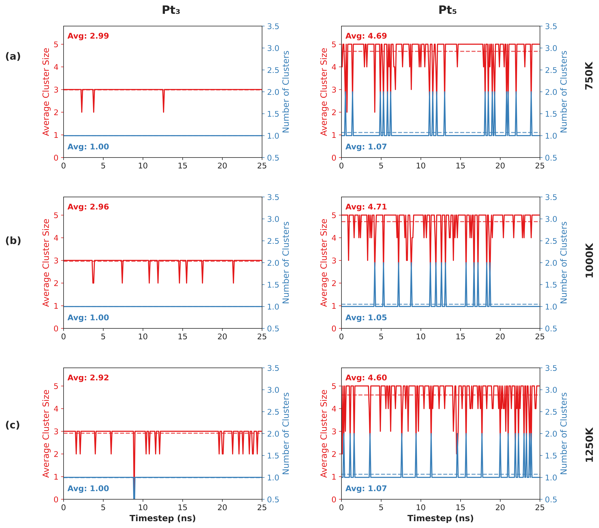
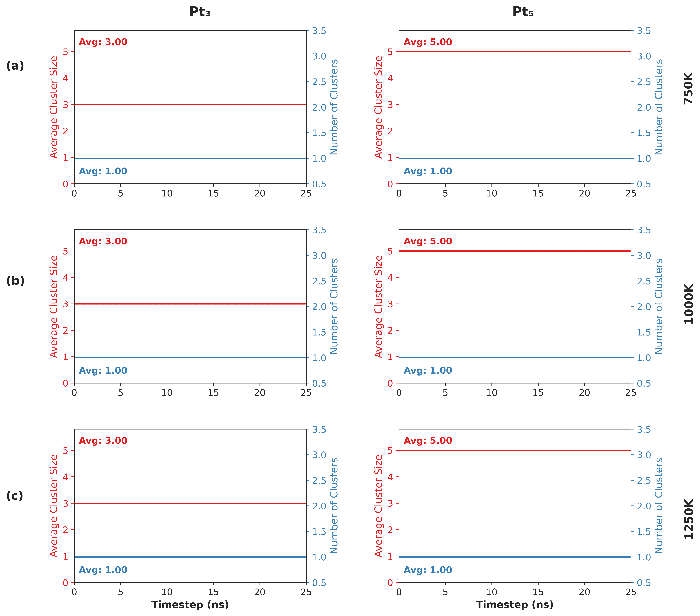

Clustering
==================================

This case study re-analyses molecular dynamics simulation data from Heard et al. [1]_, investigating platinum clusters (Pt₃, Pt₅) migration within CHA zeolite. The original work used custom reactive neural network potentials to perform ~25 ns simulations at elevated temperatures (750 K, 1000 K, 1250 K). We apply CRISP's clustering module using DBSCAN clustering.

DBSCAN Parameter Details
------------------------

DBSCAN requires two parameters: distance cutoff (ε) and minimum atoms per cluster (min_samples). We set min_samples = 2 atoms. For distance thresholds, we selected values based on Pt--Pt radial distribution functions showing sharp peaks at 2.46 Å. This justifies our primary threshold ε = 2.6 Å (first coordination shell) and secondary threshold ε = 3.0 Å (looser criterion).

Single Frame Analysis
---------------------

.. code:: python

    from CRISP.data_analysis.clustering import analyze_frame
    import os

    # Parameters
    traj_file = "./CHA/Pt5/CHA_pt5_t1250.traj"
    indices_file = "./CHA_Data_Analysis/Pt5/indices_new/Pt_indices.npy"
    threshold = 2.6
    min_samples = 2
    frame_index = 8100

    # Initialize analyzer
    analyzer = analyze_frame(
        traj_path=traj_file,
        atom_indices=indices_file,
        threshold=threshold,
        min_samples=min_samples,
        custom_frame_index=frame_index
    )

    # Run analysis
    result = analyzer.analyze_structure(
        save_html_path="clustering_results/frame8100_clusters.html",
        output_dir="clustering_results"
    )

Trajectory Analysis
-------------------

.. code:: python

    from CRISP.data_analysis.clustering import analyze_trajectory, save_analysis_results, plot_analysis_results

    # Parameters
    temperatures = [750, 1000, 1250]
    pt_cases = ["Pt3", "Pt5"]
    threshold = 3.0
    min_samples = 2
    skip_frames = 100

    for temp in temperatures:
        for pt in pt_cases:
            traj_file = f"./CHA/{pt}/CHA_{pt.lower()}_t{temp}.traj"
            indices_file = f"./CHA_Data_Analysis/{pt}/indices_new/Pt_indices.npy"
            
            # Run analysis
            analysis_results = analyze_trajectory(
                traj_path=traj_file,
                indices_path=indices_file,
                threshold=threshold,
                min_samples=min_samples,
                frame_skip=skip_frames,
                output_dir=f"{pt.lower()}_{temp}K_analysis",
                save_html_visualizations=True
            )
            
            # Save and plot results
            pickle_file = save_analysis_results(analysis_results, output_dir, prefix)
            plot_analysis_results(pickle_file, output_dir)

Results
-------

**Pt₃ Clusters:**
- ε = 2.6 Å: High stability, predominantly single cluster (~1.0), average size ~3.0. Rare fragmentation into Pt₂ + Pt₁, more frequent at higher temperatures.
- ε = 3.0 Å: Even more stable, remains single entity throughout simulation.

**Pt₅ Clusters:**
- ε = 2.6 Å: Significant instability, frequent fragmentation. Average size drops below 5.0, indicating dissociation into smaller fragments (Pt₄+Pt₁, Pt₃+Pt₂).
- ε = 3.0 Å: Remains as single cluster across all temperatures.

**Visualization:**

Summary
-------

The dual-threshold approach reveals different cluster dynamics: ε = 3.0 Å shows both clusters as cohesive entities, while ε = 2.6 Å reveals internal bond dynamics. Pt₃ maintains rigid trimer structure; Pt₅ undergoes frequent rearrangements and fragmentation. This demonstrates CRISP's capability to reveal cluster behavior at different connectivity definitions.

References
----------

.. [1] Heard, Christopher J., Grajciar, Lukáš, and Erlebach, Andreas. "Migration of zeolite-encapsulated subnanometre platinum clusters via reactive neural network potentials." *Nanoscale* 16, no. 16 (2024): 8108-8118.

