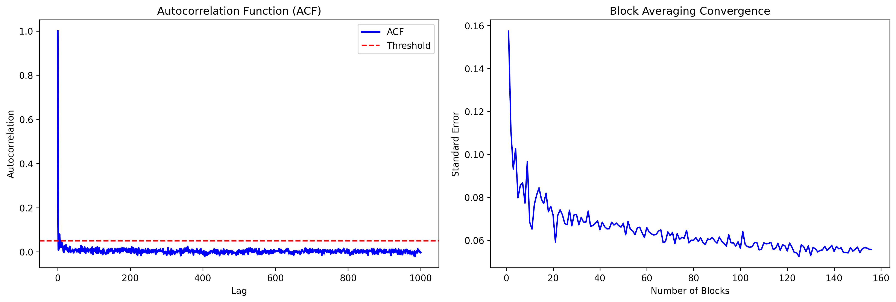

Error Analysis
==================================

Assessing statistical convergence and uncertainty in time-dependent simulations is essential for reliable conclusions. CRISP provides robust tools for error analysis that go beyond simple block averaging to offer statistically principled approaches.

Overview
--------

Block averaging divides trajectories into fixed-size blocks but is sensitive to block size choice. Autocorrelation function (ACF) analysis offers a more principled approach to quantify statistical inefficiency and evaluate convergence.

CRISP's implementation removes the need to manually determine block size and enables straightforward error estimation through autocorrelation analysis.

Basic Error Analysis
--------------------

.. code:: python

    from CRISP.simulation_utility.error_analysis import error_analysis
    import numpy as np

    # Load MD trajectory energy data
    data = np.load("energy.npy")
    
    # Perform comprehensive error analysis
    res = error_analysis(data)
    
    # Display results
    print(res["acf_results"])
    print(res["block_results"])

Case Study: Zeolite MFI Chemical Shift Analysis
-----------------------------------------------

This example demonstrates error analysis of :sup:`27`\ Al chemical shifts in zeolite MFI from 1 ns molecular dynamics trajectories based on the work of Willimetz et al. [1]_.

MD Energy Convergence Analysis
^^^^^^^^^^^^^^^^^^^^^^^^^^^^^^

We examine statistical convergence by analyzing total energy standard error over different trajectory lengths using both ACF and block averaging:

.. code:: python

    from CRISP.simulation_utility.error_analysis import error_analysis
    import numpy as np

    # Load MD trajectory energy data
    energy_data = np.load("energy.npy")
    
    # Analyze different trajectory lengths
    trajectory_lengths = [1000, 10000, 100000, 1000000]  # in fs (1ps, 10ps, 100ps, 1ns)
    
    for length in trajectory_lengths:
        subset_data = energy_data[:length]
        res = error_analysis(subset_data)
        
        acf_error = res["acf_results"]["acf_err"]
        block_error = res["block_results"]["block_err"]
        
        print(f"Time: {length/1000:.0f} ps | ACF Error: {acf_error:.1f} kJ/mol | Block Error: {block_error:.1f} kJ/mol")

**Results:**

.. code-block:: text

    Time: 1 ps | ACF Error: 64.3 kJ/mol | Block Error: 8.7 kJ/mol
    Time: 10 ps | ACF Error: 31.7 kJ/mol | Block Error: 6.9 kJ/mol
    Time: 100 ps | ACF Error: 4.6 kJ/mol | Block Error: 3.4 kJ/mol
    Time: 1000 ps | ACF Error: 0.8 kJ/mol | Block Error: 1.2 kJ/mol

Standard error decreases with increasing simulation length. At 1 ns, the SEM falls below 1 kJ/mol, indicating good sampling. ACF estimates are consistently more sensitive than block averaging, especially at shorter timescales, because ACF explicitly accounts for temporal correlations.

Chemical Shift Error Analysis
^^^^^^^^^^^^^^^^^^^^^^^^^^^^^

.. code:: python

    # Predicted chemical shift for each frame
    data = np.loadtxt("Al_nmr_results.txt", usecols=3, skiprows=1)
    res = error_analysis(data)
    print(res["acf_results"])
    print(res["block_results"])

The autocorrelation time for chemical shift is approximately 50 fs, indicating rapid equilibration. Error is less than 0.05 ppm for both methods, suggesting 1 ns simulation is sufficient for reliable :sup:`27`\ Al chemical shift prediction.

**Visualization:**

The plots show autocorrelation function decay and error convergence with simulation time.

References
----------

.. [1] Willimetz, Daniel, Erlebach, Andreas, Heard, Christopher J., and Grajciar, Lukáš. ":sup:`27`\ Al NMR chemical shifts in zeolite MFI via machine learning acceleration of structure sampling and shift prediction." *Digital Discovery* 4, no. 1 (2025): 275-288.
